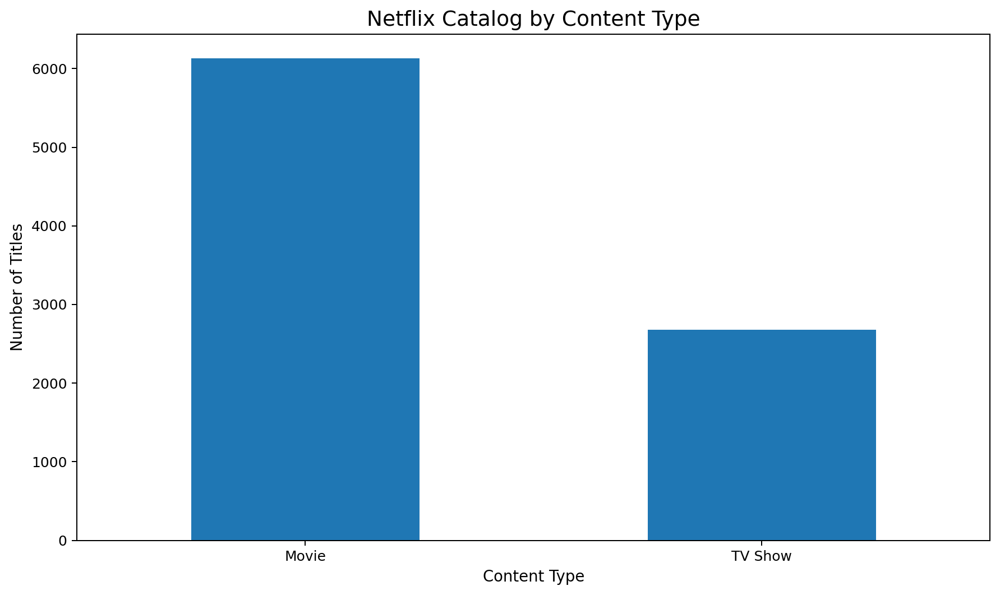
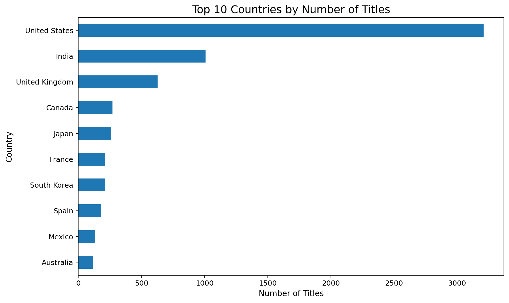
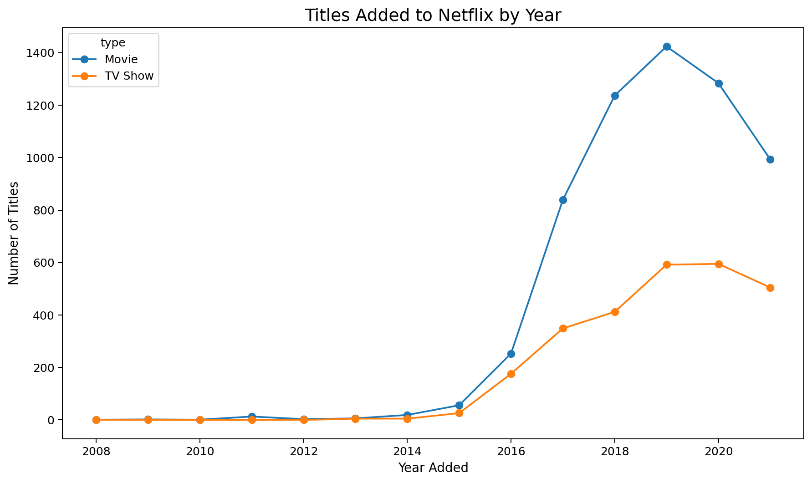
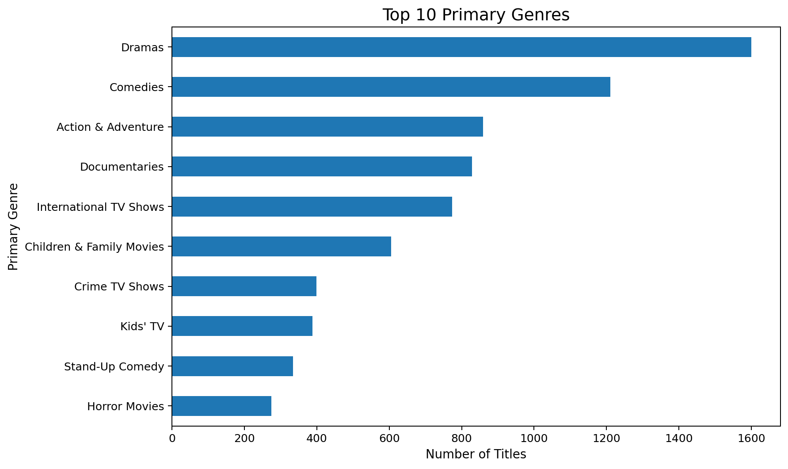

# Netflix Content Analysis Using Python


## Project overview

This project explores **8,807 Netflix titles** using Python. It demonstrates data auditing, cleaning, feature engineering, exploratory data analysis, visualization, and data storytelling in a reproducible Jupyter Notebook.

## Business questions

- What is the balance between movies and TV shows?
- Which countries contribute the most content?
- How did catalog additions change over time?
- Which ratings and genres dominate?
- What do movie runtimes and TV-show season counts look like?

## Key findings

- Movies account for **69.6%** of all titles.
- **United States** is the leading single-country contributor.
- The largest number of titles was added in **2019**.
- **TV-MA** is the most common content rating.
- **Dramas** is the most common primary genre.
- The median movie duration is about **98 minutes**.

## Sample visualizations

### Catalog composition


### Top countries


### Titles added over time


### Genre distribution


## Repository structure

```text
Netflix-Content-Analysis/
├── data/
│   ├── netflix_titles.csv
│   └── netflix_titles_cleaned.csv
├── images/
│   └── generated charts
├── notebooks/
│   └── Netflix_Content_Analysis.ipynb
├── src/
│   └── analysis.py
├── .gitignore
├── README.md
└── requirements.txt
```

## Tools used

- Python
- Pandas and NumPy
- Matplotlib
- Jupyter Notebook

## How to run

1. Clone the repository.
2. Create and activate a virtual environment.
3. Install dependencies:

```bash
pip install -r requirements.txt
```

4. Open the notebook:

```bash
jupyter notebook notebooks/Netflix_Content_Analysis.ipynb
```

The notebook detects the project folder automatically when launched from either the repository root or the `notebooks` folder.

## Data-cleaning decisions

Missing descriptive values are labeled `Unknown` rather than guessed. Dates are parsed with invalid values converted to missing dates. The mixed `duration` field is separated into movie minutes and TV-show seasons. Multi-value country and genre fields are retained while primary values are created for summary analysis.

## Future improvements

- Build an interactive Streamlit dashboard.
- Analyze cast and director collaboration networks.
- Apply natural-language processing to descriptions.
- Compare catalog strategies across streaming platforms.

## Dataset note

This project uses the provided `netflix_titles.csv` dataset. Confirm its source and license before publicly redistributing it.
